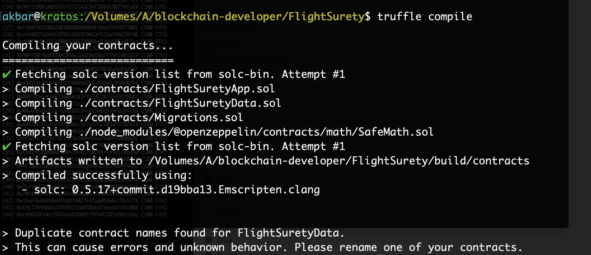
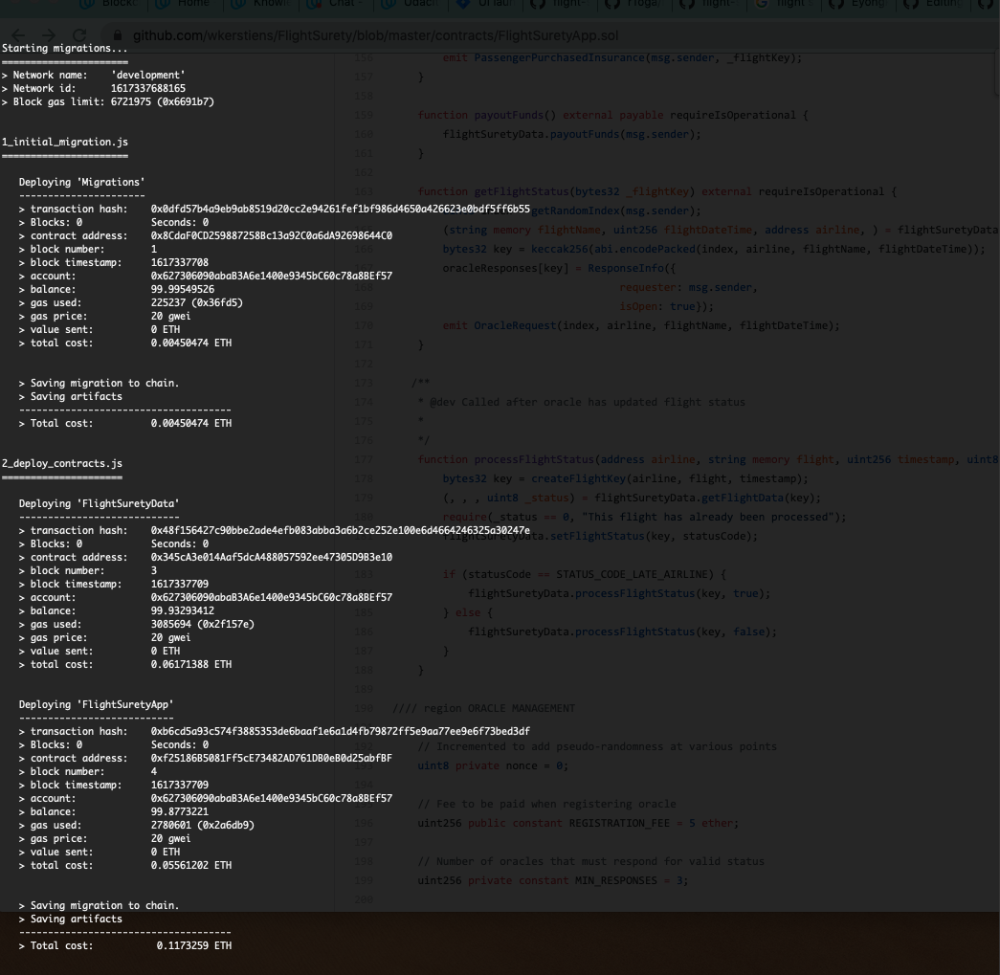
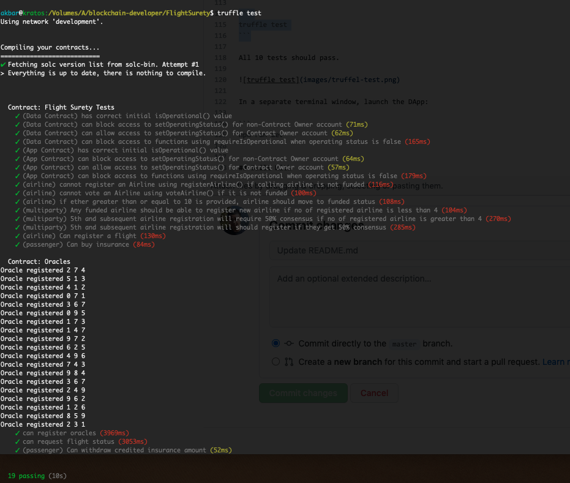
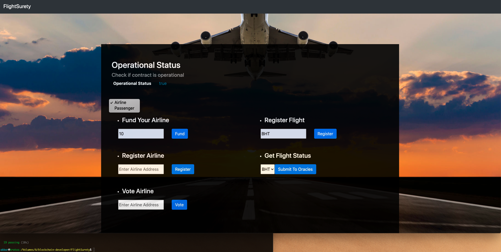
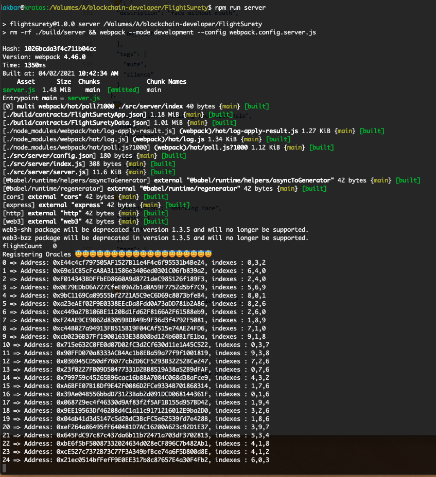

# FlightSurety Project

FlightSurety is an Ethereum DApp to manage flight insurances. If airline is late and passenger is insured then passenger will be credited 1.5 X insured amount.

## Dev Tools Version

The project was developed with  following tools/softwares.
1. Truffle v5.1.54
2. Solidity v^0.5.0
3. nodejs v12.13.1
4. web3 v1.2.9
5. Metamask Chrome Extension
6.VS Code

## Getting Started

These instructions will get you a copy of the project up and running on your local machine for development and testing purposes

### Prerequisites

Please make sure you've already installed ganache-cli, Truffle, Solidity, nodejs  and enabled MetaMask extension in your browser.

### Installing

A step by step series of examples that tell you have to get a development env running

Clone this repository:

```
git clone https://github.com/Akbarkz/supply-chain.git
```

Install dependencies and libraries:
```
npm install
```

Launch Ganache: 

```
./start_ganache-cli.sh 

```

Your terminal should look something like this:


In a separate terminal window, Compile smart contracts:

```
truffle compile
```

Your terminal should look something like this:



This will create the smart contract artifacts in folder `build\contracts`.

Migrate smart contracts to the locally running blockchain, ganache-cli:

```
truffle migrate --reset
```

Your terminal should look something like this:



Test smart contracts:

```
truffle test
```

All 19 tests should pass.




Launch Dapp:
```
npm run dapp

```


Launch Server:
```
npm run server

```


## Resources

* [Truffle Framework](http://truffleframework.com/)
* [Ganache Local Blockchain](http://truffleframework.com/ganache/)
* [Flight Surety Project FAQ — Udacity Blockchain](https://andresaaap.medium.com/flightsurety-project-faq-udacity-blockchain-b4bd4fb03320)
* [Solidity Language Reference](http://solidity.readthedocs.io/en/v0.4.24/)
* [Ethereum Blockchain Explorer](https://etherscan.io/)
* [Web3Js Reference](https://github.com/ethereum/wiki/wiki/JavaScript-API)


