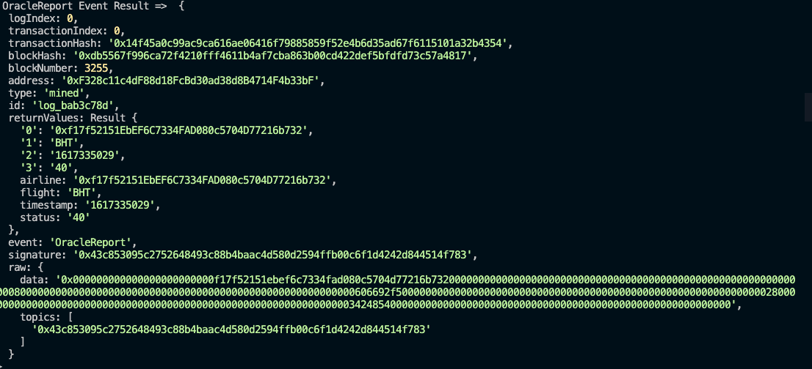
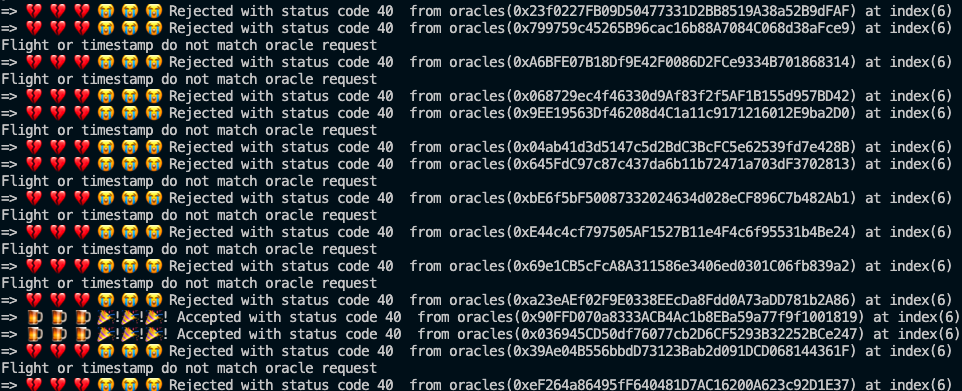

# FlightSurety Project

FlightSurety is an Ethereum DApp to manage flight insurances. If airline is late and passenger is insured then passenger will be credited 1.5 X insured amount.

##User Stories

### Airlines

1. Airline has to fund minimum 10 ether to take part in contract. If airline funds less than 10 ether than that fund is stored in airline's account. When total amount becomes equal or greater than 10 , airline is moved to funded status and can take part in contract functions.
2. Airline can register other airline.
3. Airline can register flight.
4. Registration of fifth and subsequent airlines requires multi-party consensus of 50% of registered airlines 

When the contract is deployed, second account in ganache cli is the first registered airline.
0xf17f52151EbEF6C7334FAD080c5704D77216b732 => This account if you use start_ganache-cli.sh shell file to lauch ganache.
Make sure to import this account in metamask

### Passengers

1. Passengers can choose from list of flight that are registered by airlines.
2. Passengers may pay up to 1 ether for purchasing flight insurance.
3. If flight is delayed due to airline fault, passenger receives credit of 1.5X the amount they paid
4. Passenger can withdraw any funds owed to them as a result of receiving credit for insurance payout


### Oracles

1. Upon startup, 25 oracles are registered and their assigned indexes are persisted in memory
2. Update flight status requests from client Dapp result in OracleRequest event emitted by Smart Contract that is captured by server ,displays on console and handled in code.
3. When 3 oracles provides same opinion using random status code then flight status is updated. Status can be updated only once


## Contracts

For separation of control and operational control the project is implemented using two contracts
1. FlightSuretyApp
2. FlightSuretyData
### FlightSuretyApp
1. This contract handles the application logic and multiparity consensus. The reason to keep multi parity in this contract is to easily update the  consensus rules if it changes in future.


### FlightSuretyData
1. FlightSuretyData deals with all the data storage like airlines, flight, passenger etc.
2. All the insurance amount is deposited in this contract.

Modifiers are implemented and require call are called at the beginning of function body for “fail fast” pattern.

## Dev Tools Version

The project was developed with  following tools/softwares.
1. Truffle v5.1.54
2. Solidity v^0.5.0
3. nodejs v12.13.1
4. web3 v1.2.9
5. Metamask Chrome Extension
6.VS Code

## Getting Started

These instructions will get you a copy of the project up and running on your local machine for development and testing purposes

### Prerequisites

Please make sure you've already installed ganache-cli, Truffle, Solidity, nodejs  and enabled MetaMask extension in your browser.

### Installing

A step by step series of examples that tell you have to get a development env running

Clone this repository:

```
git clone https://github.com/Akbarkz/supply-chain.git
```

Install dependencies and libraries:
```
npm install
```

Launch Ganache: 

```
./start_ganache-cli.sh 

```

Your terminal should look something like this:


In a separate terminal window, Compile smart contracts:

```
truffle compile
```

Your terminal should look something like this:


This will create the smart contract artifacts in folder `build\contracts`.

Migrate smart contracts to the locally running blockchain, ganache-cli:

```
truffle migrate --reset
```

Your terminal should look something like this:


Test smart contracts:

```
truffle test
```

All 19 tests should pass.


Launch Dapp:
```
npm run dapp

```


Launch Server:
```
npm run server

```


### Important Note.
1. Browser needs refresh when you change meta mask account to simulate as as passenger or airline and if flight list is not updated  in dropdown list when new flight is registered. 

2. All events are captured and console logged in server code.

Sample: 
OracleReport Event




3. Oracles status submission to blockchain is also logged in server console.



## Resources

* [Truffle Framework](http://truffleframework.com/)
* [Ganache Local Blockchain](http://truffleframework.com/ganache/)
* [Flight Surety Project FAQ — Udacity Blockchain](https://andresaaap.medium.com/flightsurety-project-faq-udacity-blockchain-b4bd4fb03320)
* [Solidity Language Reference](http://solidity.readthedocs.io/en/v0.4.24/)
* [Ethereum Blockchain Explorer](https://etherscan.io/)
* [Web3Js Reference](https://github.com/ethereum/wiki/wiki/JavaScript-API)


